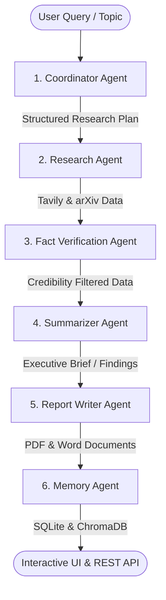

# AI Research Team using Multi-Agent Systems

A production-ready, intelligent Multi-Agent Research Assistant that automates complete research workflows using **LangGraph**, **FastAPI**, **Groq LLM**, **Tavily Web Search**, **arXiv API**, **ChromaDB**, and a luxury-inspired **Vanilla JS** frontend.

The system deploys a collaborative swarm of six specialized AI agents that formulate research plans, execute web/academic literature search strategies, verify findings for factual consistency, extract statistics, store vector memories, and generate publication-grade **PDF** and **Word (.docx)** reports.

---

## 🏛️ Architecture & Agent Swarm

The core orchestration engine is a **LangGraph StateGraph** that manages node execution state transitions:



### Agent Responsibilities

1. **Coordinator Agent (`agents/coordinator.py`)**: Analyzes the topic and breaks it down into a 4-5 key subtopic strategy.
2. **Research Agent (`agents/researcher.py`)**: Concurrently queries **Tavily Web Search** and the public **arXiv API** for academic literature.
3. **Fact Verification Agent (`agents/fact_checker.py`)**: Filters duplicate information, checks authority metrics, resolves conflicting claims, and assigns an aggregate research confidence score (0-100%).
4. **Summarizer Agent (`agents/summarizer.py`)**: Compiles findings, extracts key statistics, and drafts executive briefs.
5. **Report Writer Agent (`agents/writer.py`)**: Generates PDF documents using **ReportLab** (with a two-pass `NumberedCanvas` page numbering engine) and Word files using **python-docx**.
6. **Memory Agent (`agents/memory_agent.py`)**: Persists metadata in **SQLite** and commits index content into **ChromaDB** for semantic retrieval (with active fallback to SQLite keyword search if ChromaDB is unavailable).

---

## 🎨 Design & Features

- **Luxury Glassmorphic Interface**: Deep Plum (`#4A154B`), Royal Aubergine (`#5E2750`), Dusty Rose (`#C48CB3`), Champagne Gold (`#D4AF37`), Warm Ivory (`#F8F4EC`), and Dark Charcoal (`#2D2D2D`).
- **Real-Time Node Visualization**: Active agent highlighting in real-time as the graph executes.
- **Log Stream Handshake**: Detailed execution logs with precise microsecond durations and severity filters.
- **Publication-Grade Reports**: One-click download of PDF and DOCX reports formatted with cover pages, tables of contents, key metric callouts, and academic citations.
- **Demo Mode Support**: High-fidelity simulation mode allows full UI testing and document generation even when API keys are not provided.

---

## 📂 Project Structure

```
ai-research-team/
├── backend/
│   ├── config.py         # Path management & environment loading
│   ├── llm.py            # Groq API client & high-fidelity simulation
│   ├── main.py           # FastAPI server routing & background runner
│   └── schemas.py        # Pydantic schemas for requests/responses
├── agents/
│   ├── coordinator.py    # Subtopic planner node
│   ├── researcher.py     # Tavily & arXiv search node
│   ├── fact_checker.py   # De-duplication & confidence scoring node
│   ├── summarizer.py     # Summary compiler node
│   ├── writer.py         # ReportLab / docx report compiler node
│   └── memory_agent.py   # SQLite & ChromaDB persistence node
├── graphs/
│   ├── state.py          # State TypedDict & reducer annotations
│   └── workflow.py       # LangGraph builder & graph compiler
├── tools/
│   ├── tavily_tool.py    # Tavily Web Search API wrapper
│   └── arxiv_tool.py     # arXiv Atom XML API aggregator
├── memory/
│   └── vector_db.py      # ChromaDB wrapper with SQLite fallback
├── database/
│   └── db.py             # SQLite persistence layer
├── reports/              # Storage for generated PDF & DOCX reports
├── frontend/
│   ├── static/
│   │   ├── css/style.css # Luxury glassmorphic styling
│   │   └── js/app.js     # Frontend application logic & polling loop
│   └── templates/
│       └── index.html    # Web dashboard UI
├── tests/
│   ├── test_workflow.py  # LangGraph state machine test suite
│   └── test_api.py       # FastAPI endpoint integration tests
├── .env.example          # Environment variables template
├── requirements.txt      # Python dependencies manifest
└── README.md             # Project documentation
```

---

## ⚡ Quickstart & Setup

### 1. Prerequisites
- **Python 3.10+** (Python 3.12+ recommended)
- **pip** package installer

### 2. Installation
Clone the repository and install the required dependencies:
```bash
git clone https://github.com/JestuAshok/AI-Research-Team-.git
cd AI-Research-Team-
pip install -r requirements.txt
```

### 3. Environment Configuration
Copy `.env.example` to `.env` and set your API keys:
```bash
cp .env.example .env
```
Fill out `.env`:
```ini
GROQ_API_KEY="gsk_..."
TAVILY_API_KEY="tvly_..."

# Optional Ngrok Setup
NGROK_URL="https://your-custom-domain.ngrok-free.dev"
NGROK_AUTH_TOKEN="your_ngrok_auth_token"
```

> [!NOTE]
> If `GROQ_API_KEY` or `TAVILY_API_KEY` are omitted, the application automatically runs in **Demo Mode**, utilizing realistic agent responses and data generation so you can explore the complete interface and report generation without API costs.

### 4. Running the Server
Start the backend server using Uvicorn:
```bash
python -m uvicorn backend.main:app --host 127.0.0.1 --port 8000 --reload
```
Navigate to `http://127.0.0.1:8000` in your web browser.

---

## 🧪 Testing & Verification

Run automated tests to verify the graph workflow and REST API endpoints:
```bash
python -m unittest discover tests
```

To run a quick single-session graph test from the command line:
```bash
python scratch/test_graph.py
```

---

## 📡 API Reference

| Method | Endpoint | Description |
| :--- | :--- | :--- |
| `GET` | `/` | Web Dashboard homepage |
| `GET` | `/api/config` | Configuration & Demo Mode status |
| `POST` | `/research` | Initiate a new research task (returns `session_id`) |
| `GET` | `/status/{id}` | Query execution status, logs, & results for session |
| `GET` | `/history` | Fetch historical research sessions |
| `GET` | `/api/stats` | Summary analytics for dashboard stats |
| `GET` | `/download/pdf/{id}`| Download compiled PDF report |
| `GET` | `/download/docx/{id}`| Download compiled DOCX report |
| `POST`| `/memory/search` | Perform semantic vector search over past research |

---

## 📜 License

Distributed under the MIT License. See `LICENSE` for details.
